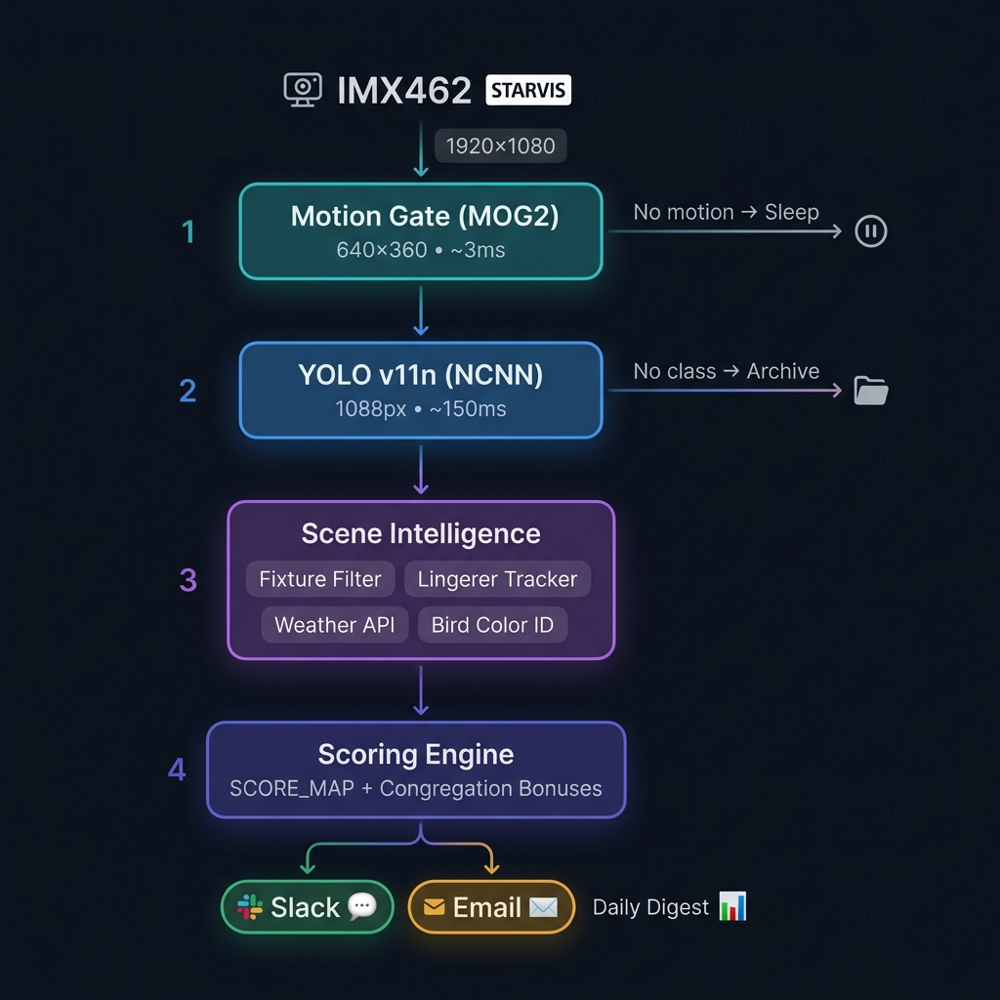

<p align="center">
  
</p>

<p align="center"><strong>Privacy-First, Visual-to-Emoji Yard Monitor</strong></p>
<p align="center">
  Open-source edge AI on a Raspberry Pi 5 — watches your yard and sends emoji alerts.<br>
  No video saved. No cloud inference. No surveillance. Just signal.
</p>

<p align="center">
  <a href="LICENSE"></a>
</p>

---

## Overview

Rook is a sensor system that watches your yard and sends emoji summaries of what's happening — `🚚📦` for a delivery, `🦅` for a hawk, `🐺⚠️` for a possible coyote, `🌅` at sunrise, `🚗🔒` for a car parked over an hour.

It runs 24/7 on a Raspberry Pi 5 with a Sony STARVIS camera and [YOLO26n](https://docs.ultralytics.com/models/yolo11/), processing everything on-device.

| Principle | Implementation |
|---|---|
| **Privacy by design** | No video saved or transmitted. Frames exist only in RAM during inference. |
| **Signal over noise** | Solo cars counted silently. Static fixtures auto-suppressed. Only meaningful activity fires alerts. |
| **Always on** | Headless Pi 5 + Slack/Email. No subscriptions, no cloud GPU, no monthly cost. |

---

## Architecture

<p align="center">
  
</p>

Every frame passes through a four-stage pipeline. Each stage acts as a progressive filter — only meaningful events survive to trigger a notification.

### Stage 1 — Motion Gate (MOG2)

The camera feed is downscaled to **640×360** and passed through OpenCV's MOG2 background subtractor (~3ms). Two checks must pass:

1. **Pixel count**: Total changed pixels must exceed `MOTION_THRESHOLD_PIXELS`
2. **Blob analysis**: The largest contiguous blob must exceed `MOTION_BLOB_MIN_PIXELS`

If neither passes, the frame is discarded and YOLO never runs — saving ~150ms of CPU per idle frame. A **forced YOLO scan** every 5 minutes bypasses this gate to catch objects that MOG2 has absorbed into the background model (e.g., a car that parked and stopped moving).

### Stage 2 — Object Detection (YOLO26n NCNN)

Qualifying frames are upscaled to **1088px** and passed through YOLO26n exported to [NCNN format](https://github.com/Tencent/ncnn) for ~3× faster inference vs. PyTorch on CPU (~150ms per frame).

| Parameter | Value | Rationale |
|---|---|---|
| Confidence threshold | `0.70` | Uniform across all hours — minimizes false positives |
| Airborne gate | `0.75` | Birds, airplanes, kites require extra certainty (distant sky noise) |
| Ignored classes | `train`, `traffic light`, `boat` | Site-specific false positives (see [Suppressed Classes](#suppressed-classes)) |

### Stage 3 — Scene Intelligence

Detections pass through four enrichment layers before scoring:

| Module | Purpose |
|---|---|
| **SceneFixtureFilter** | Auto-suppresses objects appearing in ≥80% of recent inferences at the same screen position. Resets daily. |
| **LingererTracker** | Monitors dwell time per object per zone. Fires delayed alerts for parked cars (60 min), loiterers (5 min). 3-frame grace period prevents eviction from brief occlusions. |
| **Open-Meteo Weather** | 15-minute cached weather enrichment. Extreme conditions (storms, heat, snow) add score bonuses. |
| **Bird Color ID** | HSV analysis on bird bounding boxes. Identifies cardinals (🔴🐦), blue jays (🔵🐦), dark raptors (🦅). |

### Stage 4 — Scoring & Dispatch

Each detection set is scored by `calculate_image_score()`. Score determines notification routing:

Score ≥ 30  →  Slack + Email (with annotated image)
Score < 30  →  Logged to daily digest only
```

Score bonuses ensure multi-subject events always notify:

| Trigger | Bonus | Floor |
|---|---|---|
| 3+ objects in scene | +15 | 30 |
| 5+ objects in scene | +25 | 30 |
| 3+ people | +10 | 30 |
| 5+ people | +30 | 30 |
| Unaccompanied animal | +15 | 30 |
| Any person during quiet hours | +20 | 30 |

Solo cars, bicycles, and horses are silently counted — no real-time alert.

---

## Emoji Vocabulary

Rook translates detections into contextual emoji summaries. Composite heuristics combine class, count, time-of-day, proximity, and motion data.

### People

| Emoji | Event | Trigger |
|---|---|---|
| 🏟️ | Large crowd | 5+ people |
| 👥 | Group | 2–4 people |
| 🏃 | Runner | Solo person + large motion blob |
| 🚴 | Cyclist | Bicycle + person |
| 🌙🚶 | Night walker | Person during nighttime |
| 🌂🚶 | Rain walk | Umbrella + person |
| 🚚📦 | Moving day | Suitcase + person |
| 🏃⚽ | Street play | Sports ball or frisbee + person |

### Wildlife

| Emoji | Event | Trigger |
|---|---|---|
| 🐻 | Bear | Immediate high-priority (score 100) |
| 🐺⚠️ | Possible coyote | Spatially isolated dog, quiet hours or dawn |
| 🐕⚠️ | Loose dog | Spatially isolated dog, daytime |
| 🐕 | Accompanied dog | Dog near a person (assumed on-leash) |
| 🦅 | Raptor | Solo bird, dark plumage |
| 🔴🐦 | Cardinal | Bird with red HSV signature |
| 🔵🐦 | Blue jay | Bird with blue HSV signature |
| 🐾🐾🐾 | Animal cluster | 3+ animals in scene |

### Vehicles & Atmospheric

| Emoji | Event | Trigger |
|---|---|---|
| 🚗🔒 | Parked car | Lingering > 60 min in same zone |
| 🚶⏱️ | Loiterer | Person lingering > 5 min in same zone |
| ✈️⬇️ | Low-flying aircraft | Airplane detection |
| 🪁🌬️ | Kite / wind event | Kite + person |
| 🌅 | Sunrise | Exposure mode switch to daytime |
| 🌆 | Sunset | Exposure mode switch to nighttime |

---

## Notifications

### Channels

| Channel | Threshold | Behavior |
|---|---|---|
| **Slack** | Score ≥ 30 | Real-time emoji alert. Active 24/7. |
| **Email/MMS** | Score ≥ 30 | High-priority events with annotated image. **Suppressed during quiet hours** (11 PM–6 AM). |
| **Lingerer alerts** | Threshold-based | Direct Slack + Email. Bypass score gate. Re-alert every 15 min. |
| **Daily Digest** | Automatic | 3 AM email: yesterday's activity counts, cumulative stats, top event image, Beast Cam crops. |
| **Heartbeat** | Every 6 hours | Slack ping confirming the engine is alive. |

### Quiet Hours (11 PM – 6 AM)

During quiet hours, email is suppressed (no phone buzzing overnight). Slack alerts continue with a 🌙 prefix. Any person detected during quiet hours automatically gets a +20 score bonus and a floor of 30.

### Cooldown

Alerts use a score-adaptive cooldown to prevent spam:
- High-priority events (score ≥ 60): **10-second** cooldown
- Low-priority events (score ~8): **52-second** cooldown
- Redundant scenes (same classes as last alert) are always skipped

---

## Scene Intelligence

### Fixture Suppression

`SceneFixtureFilter` maintains a rolling window of the last 60 YOLO inferences. Any `(class, zone)` pair appearing in ≥80% of those inferences is promoted to a **fixture** and silently dropped from future detections — preventing a static houselight, signpost, or long-parked neighbor's car from consuming the alert budget.

> **Note**: Classes tracked by the `LingererTracker` (car, motorcycle, bicycle, person) are **exempt** from fixture suppression. This ensures a parked car can accumulate the full 60-minute dwell time needed to trigger a lingering alert, even though it would otherwise be promoted to a fixture after ~48 seconds.

Fixture lists reset daily at the digest rollover.

### Lingerer Detection

`LingererTracker` observes objects across consecutive YOLO scans using a coarse 4×4 grid-cell zone system.

| Class | Threshold | Alert |
|---|---|---|
| Car | 60 min | 🚗🔒 Parked vehicle |
| Motorcycle | 30 min | 🏍️🔒 Parked motorcycle |
| Bicycle | 30 min | 🚲🔒 Unattended bicycle |
| Person | 5 min | 🚶⏱️ Loitering individual |

A **3-frame grace period** prevents premature eviction from brief occlusions (a passing car, a confidence dip, or thermal frame-skipping). Re-alerts fire every 15 minutes if the object is still present. The forced YOLO timer (every 5 min) ensures objects absorbed into MOG2's background model are still observed.

### Suppressed Classes

These COCO classes are permanently ignored in this deployment:

| Class | Reason |
|---|---|
| `train` | No rail infrastructure — misclassifies dark boxy vehicles at distance |
| `traffic light` | Park houselight across the street — persistent false positive |
| `boat` | No navigable water — park fence / reflective surface triggers |

### Thermal Management

The Pi 5 runs warm under continuous inference. The engine implements progressive throttling:

| SoC Temperature | Behavior |
|---|---|
| < 65°C | Full speed (~6 FPS) |
| 65–72°C | Process 1 in 3 frames |
| 72–80°C | Process 1 in 6 frames |
| ≥ 80°C | Shutdown (hardware protection) |

Temperature is checked every 30 seconds. Thermal state is logged and included in the daily evaluation report.

---

## Hardware

| Component | Part | Notes |
|---|---|---|
| SBC | Raspberry Pi 5 (2GB+) | 2GB sufficient; 4GB provides headroom |
| Camera | Arducam B0444 (IMX462 STARVIS, 1/2.8") | Excellent low-light sensitivity |
| OS | Debian Trixie (64-bit) | Required for Pi 5 kernel support |
| Power | 5V/5A USB-C PD | Underpowering causes throttling |

See [`device/bom.md`](device/bom.md) for the full bill of materials.

---

## Setup

### 1. Flash OS

Flash **Debian Trixie (64-bit)** via Raspberry Pi Imager. Enable SSH and set hostname to `rook`.

### 2. Configure Camera

Add to `/boot/firmware/config.txt`:

```ini
camera_auto_detect=0
dtoverlay=arducam-pivariety
```

### 3. Install Dependencies

```bash
git clone https://github.com/Cook4986/rook-sensor.git
cd rook-sensor/app
chmod +x setup_pi.sh && ./setup_pi.sh
```

`setup_pi.sh` installs Python, OpenCV, Ultralytics, creates a virtual environment at `~/rook-env`, exports the NCNN model, and registers the systemd service.

### 4. Configure Environment

Create `~/rook-env/.env`:

```bash
# ── Notification channels ──
SLACK_WEBHOOK_URL=https://hooks.slack.com/...
NOTIFY_EMAIL=you@example.com
NOTIFY_TO_NUMBER=+15551234567

# OPT-IN CONSENT: By entering your NOTIFY_TO_NUMBER above, you consent to receive 
# automated SMS alerts from your device. Message frequency varies. Message and data 
# rates may apply. Reply STOP to cancel. Terms: https://github.com/Cook4986/rook-sensor/blob/main/TERMS.md 
# Privacy: https://github.com/Cook4986/rook-sensor/blob/main/PRIVACY.md

# ── Twilio (Required for SMS) ──
TWILIO_ACCOUNT_SID=AC...
TWILIO_AUTH_TOKEN=...
TWILIO_FROM_NUMBER=+15559876543

# ── SMTP (Gmail app password recommended) ──
SMTP_SERVER=smtp.gmail.com
SMTP_PORT=587
SMTP_USER=you@gmail.com
SMTP_PASS=your-app-password

# ── Location (for weather enrichment + sunrise/sunset) ──
LATITUDE=40.71
LONGITUDE=-74.00

# ── Camera ──
FLIP_180=1              # Set to 0 if camera is right-side-up

# ── Diagnostics (uncomment as needed) ──
# TEST_EMAIL=1          # Email a live frame on next restart (one-shot)
```

### 5. Start the Service

```bash
sudo systemctl enable --now rook.service
```

The engine starts automatically on boot. Logs are written to `~/rook.log`.

---

## Deployment

After editing `rook_engine.py` locally, deploy to the Pi:

```bash
# From your Mac — uses scp to push scripts and restarts the service
bash app/deploy_to_pi.sh              # defaults to rook@rook.local
bash app/deploy_to_pi.sh user@host    # custom host
```

---

## Diagnostic Tools

### Live Frame Test

Captures a single frame, runs inference, and optionally emails the annotated result. **Requires the engine to be stopped** (camera conflict).

```bash
source ~/rook-env/bin/activate
python3 ~/frame_test.py --email        # Capture → infer → email annotated frame
python3 ~/frame_test.py --benchmark    # 10-iteration inference timing
```

### In-Engine Test Email

Set `TEST_EMAIL=1` in `~/rook-env/.env` and restart the service. The engine sends a live annotated frame on startup, then resumes normal operation. Remove the flag after use.

### Performance Evaluation

Analyzes `rook.log` to produce a comprehensive report covering detection volume, alert rates, fixture suppression efficiency, ghost-motion gate performance, thermal behavior, and automated recommendations.

```bash
# Run from Mac or Pi
python3 app/rook_eval.py                              # reads ~/rook.log
python3 app/rook_eval.py /path/to/rook.log --json     # explicit path + JSON output
```

### Thermal Stress Test

Runs continuous YOLO inference for a set duration while logging SoC temperature. Useful for validating cooling solutions.

```bash
python3 app/thermal_stress_test.py     # default 5-minute stress run
```

---

## NCNN Model

The engine uses YOLO26n exported to [NCNN format](https://github.com/Tencent/ncnn) at `imgsz=1088` for ~3× faster inference vs. PyTorch on CPU. The export is handled automatically by `setup_pi.sh`, but to regenerate manually:

```bash
source ~/rook-env/bin/activate
python3 -c "from ultralytics import YOLO; YOLO('yolo26n.pt').export(format='ncnn', imgsz=1088)"
mv yolo26n_ncnn_model yolo26n_1088_ncnn_model
```

The engine automatically falls back to `yolo26n.pt` (PyTorch) if the NCNN directory is not found.

---

## Archive & Sync

Rook archives two categories of images on the Pi for downstream model training and review:

| Archive | Path on Pi | Content |
|---|---|---|
| **Unclassified motion** | `~/rook-archive/unclassified/` | Frames where MOG2 detected motion but YOLO found nothing. Gated by a multi-frame persistence filter. |
| **Beast Cam** | `~/beast_cam/` | Cropped wildlife detections (birds, animals). Auto-purged after 7 days. |

### Sync to Mac (launchd)

A `launchd` agent runs every 15 minutes, pulling new files from the Pi via `scp` to a local staging directory, then copying into Dropbox:

```
Pi → scp → ~/rook-staging/ → cp → ~/Library/CloudStorage/Dropbox/Rook/archive/
```

Installation:

```bash
# Install the launchd agent (replaces any prior crontab entry)
cp app/com.rook.sync.plist ~/Library/LaunchAgents/
launchctl load ~/Library/LaunchAgents/com.rook.sync.plist

# Verify
launchctl list | grep rook

# Logs
tail -f /tmp/rook_sync.log
```

> **Note**: The sync script lives at `~/bin/rook_sync.sh` (not inside Dropbox) because macOS restricts `launchd` access to `~/Library/CloudStorage/`. If you update `app/sync_archive.sh`, copy it to `~/bin/rook_sync.sh`.

### Mac-Side Reclassification

After syncing, run `reclassify_archive.py` on your Mac to re-infer unclassified frames with a larger YOLO model (YOLOv11l) using Apple MPS acceleration. Finds objects the Pi's nano model missed — especially distant park subjects.

```bash
python3 app/reclassify_archive.py              # process all pending frames
python3 app/reclassify_archive.py --model x    # use yolo11x.pt (maximum quality)
python3 app/reclassify_archive.py --dry-run    # report without moving files
python3 app/reclassify_archive.py --slack      # send Slack digest of findings
```

### Manual Cleanup

```bash
# Clear old files on the Pi to free SD card space
ssh rook@rook.local "find ~/rook-archive/unclassified/ -name '*.jpg' -mtime +7 -delete"
ssh rook@rook.local "find ~/beast_cam/ -name '*.jpg' -mtime +7 -delete"
ssh rook@rook.local "df -h ~"   # verify space freed
```

---

## Custom Model Training

The base YOLO26n model covers 80 COCO classes but cannot distinguish site-specific objects (Amazon van vs. generic truck, trash truck vs. delivery). See [`rook_custom_model_proposal.md`](rook_custom_model_proposal.md) for the full pipeline:

1. **Data mining** — Unclassified archive + Beast Cam crops provide training data
2. **Annotation** — Roboflow or CVAT for bounding box labeling (target: 300–500 samples per class)
3. **Fine-tuning** — Transfer learning on `yolo26n.pt` with `imgsz=1088` to match deployment resolution
4. **NCNN export** — Required to maintain ~150ms inference on the Pi's CPU
5. **Integration** — Add new classes to `SCORE_MAP`, `EMOJI_MAP`, and scene heuristics

---

## Project Structure

```
rook-sensor/
├── README.md                          # This file
├── PRIVACY.md                         # Privacy policy
├── TERMS.md                           # Terms of service
├── LICENSE                            # MIT
├── rook_custom_model_proposal.md      # Custom YOLO training plan
│
├── app/
│   ├── rook_engine.py                 # Core detection engine (runs on Pi)
│   ├── rook_eval.py                   # Log analysis & performance evaluation
│   ├── rook_weather.py                # Weather enrichment module
│   ├── frame_test.py                  # Single-frame diagnostic tool
│   ├── reclassify_archive.py          # Mac-side re-inference with larger model
│   ├── thermal_stress_test.py         # SoC thermal validation
│   ├── setup_pi.sh                    # Pi first-boot setup script
│   ├── deploy_to_pi.sh               # Mac → Pi deployment script
│   ├── sync_archive.sh               # Pi → Mac archive sync (scp-based)
│   └── com.rook.sync.plist            # macOS launchd agent for sync scheduling
│
├── assets/
│   ├── rook_logo.png                  # Project logo
│   └── architecture.png              # Pipeline architecture diagram
│
├── device/
│   └── bom.md                         # Bill of materials
│
└── docs/
    ├── camera_calibration.md          # IMX462 tuning notes
    ├── emoji_vocabulary.md            # Extended emoji reference
    └── refinements.md                 # Historical engineering decisions
```

---

## License

MIT — see [LICENSE](LICENSE).

<p align="center"><sub>Built by <a href="https://matthewacook.com">Matthew Cook</a></sub></p>
