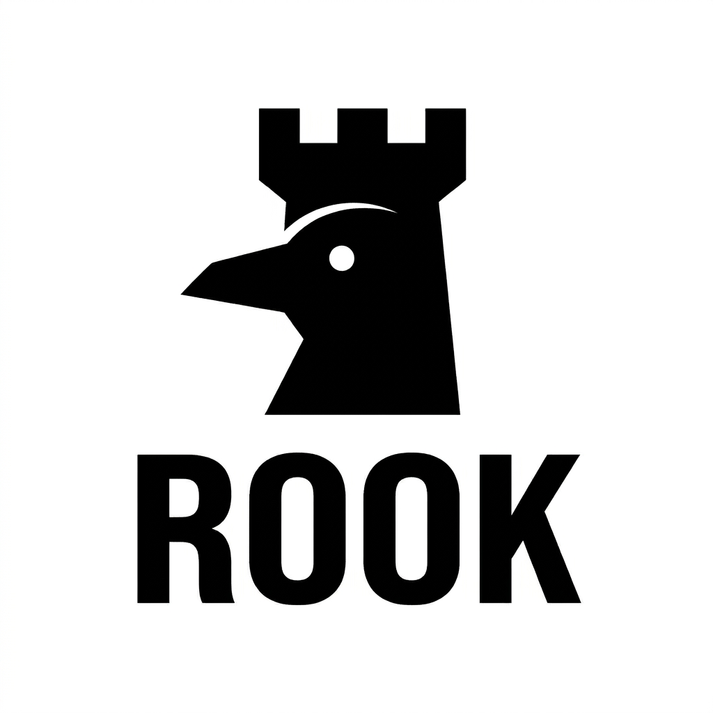

<p align="center">
  
</p>

<p align="center"><strong>Privacy-First, Visual-to-Emoji Yard Monitor</strong></p>
<p align="center">
  Open-source edge AI on a Raspberry Pi 5 — watches your yard and sends emoji alerts.<br>
  No video saved. No cloud inference. No surveillance. Just signal.
</p>

<p align="center">
  <a href="LICENSE"></a>
</p>

---

## What It Does

Rook is a sensor system that watches your yard and sends emoji summaries of what's happening — `📦🚚` for a delivery, `🦅` for a hawk, `🐕⚠️` for a loose dog, `⛈️` during a storm.

It runs 24/7 on a Raspberry Pi 5 with a Sony STARVIS sensor and [YOLOv11n](https://docs.ultralytics.com/models/yolo11/), processing everything on-device at the edge.

| Principle | How |
|-----------|-----|
| **Privacy by design** | No video is ever saved or transmitted. Frames exist only in RAM during inference, then are discarded. |
| **Signal over noise** | Car-only scenes are silently counted but never alerted. Only meaningful activity fires a notification. |
| **Always on, low cost** | Headless Pi 5 + Slack/Email. No subscriptions, no cloud GPU, no app to install. |

---

## How It Works

```
Camera (IMX462 STARVIS, 1920×1080)
  │
  ▼  10 FPS polling
┌──────────────────────────────────────────┐
│  Stage 1 — Motion Gate  (MOG2)           │
│  640×360 downscale • ~3ms/cycle          │
│                                          │
│  No motion? → sleep. YOLO never runs.   │
└──────────┬───────────────────────────────┘
           │ motion > 500px changed
           ▼
┌──────────────────────────────────────────┐
│  Stage 2 — YOLO Inference                │
│  1920×1080 (1088px) • YOLOv11n          │
│  conf=0.25 • ~850ms (CPU-only)          │
│                                          │
│  → Emoji translation                     │
│  → Silent solo filter (car-only = skip) │
│  → 60s alert cooldown + redundancy gate │
└──────────┬───────────────────────────────┘
           │
           ▼
┌──────────────────────────────────────────┐
│  Stage 3 — Enrichment (zero CPU cost)   │
│  • Open-Meteo weather (15-min cache)    │
│  • iNat local species context           │
│  • Frame fog/low-light heuristic        │
└──────────┬───────────────────────────────┘
           │
           ▼
┌──────────────────────────────────────────┐
│  Alert Dispatch (async background)       │
│  Slack → real-time emoji ping            │
│  Email → high-score events (≥15 pts)    │
│  3 AM daily digest → stats + Beast Cam  │
└──────────────────────────────────────────┘
```

**Net effect:** Empty yard at 3 AM → YOLO never runs. Hawk in the tree → `🦅` Slack alert within 2 seconds.

---

## Hardware

| Part | Model | Notes |
|------|-------|-------|
| Compute | Raspberry Pi 5 (2 GB) | Quad-core Cortex-A76 @ 2.4 GHz, headless 64-bit |
| Sensor | [Arducam B0444](https://www.arducam.com/product/arducam-2mp-imx462/) (IMX462 STARVIS) | 2MP, f/1.6, M12 fixed lens, 141° FOV. **Pivariety** MCU. Board is 24×25mm — no standard mounting holes. |
| Storage | SanDisk 32 GB High Endurance | Endurance-rated for 24/7 writes |
| Thermal | Easycargo heatsink kit | Passive aluminum + copper. ~53°C idle, ~67°C under inference. Hard cutoff at 80°C. |
| Mount | Juxiamal 41mm PVC suction cups (M5) | 4× interior window glass mount |
| Power | Modular 5V/5A USB-C PD Charger | **Required.** Standard 3A chargers cause brownouts under inference load. |
| Power Cable | 10ft Flat 100W USB-C Cable | Must have 5A E-Marker chip. Flat profile routes through window sill gaps. |

**Prototype cost:** ~$213 all-in. Full BOM in [`device/bom.md`](device/bom.md).

---

## Software Stack

| Layer | Technology | Notes |
|-------|------------|-------|
| OS | Raspberry Pi OS Lite 64-bit (Debian Trixie) | Headless, no desktop |
| Camera driver | Arducam Pivariety (`arducam-pivariety,cam1`) | Required for B0444 MCU — native `imx462` overlay will not work |
| Python env | `~/rook-env` (`--system-site-packages`) | Required for `picamera2` / libcamera bindings |
| AI model | YOLOv11n | 2.6M params, COCO 80-class, `conf=0.25`, `imgsz=1088` |
| Inference | PyTorch CPU (`aarch64`) | ~850ms/frame @ 1088px on Cortex-A76 |
| Motion gate | OpenCV MOG2 | `history=200`, `varThreshold=40` on 640×360 downscale |
| Alerts | Slack Webhook + SMTP | Async dispatch — main loop never blocks |
| Enrichment | Open-Meteo + iNat Observations API | Weather context + local species hints — no API key required |
| Process mgmt | `systemd` (`rook.service`) | Auto-starts on boot, restarts on crash |

### OS Hardening

| Measure | Purpose |
|---------|---------|
| `tmpfs` on `/tmp` (64 MB) and `/var/log` (32 MB) | Minimize SD card write wear |
| Hardware watchdog (`bcm2835_wdt`) | Auto-reboot on process or OS hang |
| 2 GB swap file | Prevent OOM during inference |
| SSH key auth (ed25519) | Secure remote access |

---

## Quick Start

> Full step-by-step with troubleshooting in [`device/assembly.md`](device/assembly.md).

### 1. Flash

[Raspberry Pi Imager](https://www.raspberrypi.com/software/) → **Pi OS Lite 64-bit (Trixie)** → hostname `rook`, SSH enabled, Wi-Fi configured.

### 2. Assemble

1. Apply heatsink to SoC with thermal tape.
2. Connect CSI cable to **CAM/DISP 1** (farther from Ethernet). Metal contacts face the Ethernet port.
3. Insert SD card, connect power.

> [!WARNING]
> **Use CAM/DISP 1 only.** The B0444 produces I2C errors (`-121 EREMOTEIO`) on CAM/DISP 0. See [`device/assembly.md`](device/assembly.md).

### 3. Deploy

```bash
# Push files to Pi
bash app/deploy_to_pi.sh rook@rook.local

# SSH in and run setup
ssh rook@rook.local
bash ~/setup_pi.sh    # OS hardening, Arducam driver, Python venv
sudo reboot
```

### 4. Camera Driver

```bash
# /boot/firmware/config.txt:
camera_auto_detect=0
dtoverlay=arducam-pivariety,cam1

# Install Arducam patched libcamera:
./install_pivariety_pkgs.sh -p libcamera_dev
./install_pivariety_pkgs.sh -p libcamera_apps
```

### 5. Validate

```bash
source ~/rook-env/bin/activate

rpicam-still --list-cameras          # Should show arducam-pivariety [1920x1080]
rpicam-still -o test.jpg -t 2000     # Capture test frame
python3 ~/frame_test.py --email      # Send annotated YOLO frame to your inbox
```

### 6. Secrets

```bash
cat > ~/rook-env/.env << 'EOF'
SLACK_WEBHOOK_URL=https://hooks.slack.com/services/...
SMTP_SERVER=smtp.gmail.com
SMTP_PORT=587
SMTP_USER=your.email@gmail.com
SMTP_PASS=your_16_char_app_password
NOTIFY_EMAIL=your.email@gmail.com
LATITUDE=your_latitude
LONGITUDE=your_longitude
FLIP_180=1
EOF
```

### 7. Start

```bash
# Engine runs as a systemd service — auto-starts on boot
sudo systemctl start rook.service
sudo systemctl status rook.service    # Should show: active (running)
```

---

## Alert System

### Real-Time (Slack)
Every detection with score ≥ 1 fires a Slack message. Car-only scenes are silently counted in daily stats but never alerted.

### Real-Time (Email)
High-value detections (score ≥ 15) get an email with the annotated YOLO image attached.

### Daily Digest (3 AM)
Sent every night at 3 AM — the lowest-activity window — to avoid interrupting active detection cycles:
- **Activity totals:** Traffic, Pedestrians, Animals, Deliveries
- **Top event of the day** with annotated image
- **Beast Cam:** Up to 10 cropped wildlife images from the day
- **System health:** SoC temperature, uptime

### Scoring

Rarer detections score higher. Score determines whether real-time email fires and ranks the daily best image.

| Class | Score | Notes |
|---|---|---|
| `person`, `car` | 1 | Routine — Slack only |
| `dog`, `bicycle`, `backpack` | 2 | Common |
| `truck`, `bus`, `kite` | 5 | Notable |
| `cat` | 10 | Uncommon |
| `bird` | 15 | Triggers email |
| `horse`, `sheep`, `cow` | 50 | Rare — triggers email |
| `bear` | 100 | Critical |

### Quiet Hours
11 PM – 6 AM: routine alerts suppressed. High-score events still fire.

---

## Beast Cam

When YOLO detects wildlife (`bird`, `dog`, `cat`, `bear`, `horse`, `sheep`, `cow`), Rook saves a cropped, padded bounding-box image to `~/beast_cam/YYYY-MM-DD/`. These are attached to the 3 AM digest and then immediately deleted from the device after successful delivery.

---

## Emoji Vocabulary

Full vocabulary in [`docs/emoji_vocabulary.md`](docs/emoji_vocabulary.md).

| Emoji | Trigger |
|---|---|
| `🚶` / `👥` / `🏟️` | 1 / 2+ / 4+ people |
| `🚗` `🚚` `🚌` `🏍️` | Car / Truck / Bus / Motorcycle |
| `🦅` | Bird detected |
| `🐕` / `🐕⚠️` | Dog with person / Loose dog |
| `🐻` | Bear — critical alert |
| `🌫️` | Fog detected (frame heuristic) |
| `🌧️` `❄️` `⛈️` | Weather from Open-Meteo |

---

## Thermal Safety

The engine reads `/sys/class/thermal/thermal_zone0/temp` every 30 seconds:

| Threshold | Action |
|-----------|--------|
| < 80°C | 🟢 Normal |
| ≥ 80°C | 🔴 `sudo shutdown -h now` — hardware protection |

Observed temps: **~53°C idle**, **~67°C under inference** (passive heatsink, indoor mount).

---

## Repo Structure

```
rook-sensor/
├── app/
│   ├── rook_engine.py      # Main vision daemon
│   ├── rook_weather.py     # Weather + species enrichment module
│   ├── frame_test.py       # Viewfinder + YOLO benchmark
│   ├── setup_pi.sh         # One-shot Pi setup
│   └── deploy_to_pi.sh     # SCP deploy helper (run from Mac)
├── device/
│   ├── assembly.md         # Step-by-step build guide
│   └── bom.md              # Bill of materials
├── docs/
│   ├── emoji_vocabulary.md
│   ├── camera_calibration.md
│   └── refinements.md
├── assets/
│   └── rook_logo.png
└── README.md
```

---

## Known Issues & Lessons Learned

| Issue | Resolution |
|-------|------------|
| B0444 not detected on CAM/DISP 0 | Use **CAM/DISP 1** — Pivariety MCU only works on `cam1` |
| `dtoverlay=imx462` fails | B0444 is Pivariety. Use `dtoverlay=arducam-pivariety,cam1` |
| Solid red LED after thermal spike | Pi has shut down (80°C cutoff triggered). Power cycle to recover. Systemd restarts engine automatically after boot. |
| YOLO inference ~850ms (not ~80ms) | Expected on CPU-only Pi 5. Adequate for motion-gated architecture. Upgrade: Hailo-8L HAT+. |
| OOM crash during ONNX export | 2 GB RAM too tight for ONNX session optimization. Use PyTorch `.pt` model. |
| 5V/3A charger causes brownouts | Pi 5 requires **5V/5A** under inference load. See Hardware section. |

---

## Roadmap

- [x] Hardware assembly + camera validation
- [x] OS hardening (tmpfs, watchdog, SSH keys)
- [x] Arducam Pivariety driver + first light (1920×1080 @ 60fps)
- [x] YOLOv11n inference pipeline (1088px, conf=0.25)
- [x] MOG2 motion gate (640×360, 500px threshold)
- [x] Emoji translation + alert scoring
- [x] Async Slack + Email alert dispatch
- [x] Quiet hours suppression
- [x] Thermal hard cutoff at 80°C
- [x] Silent solo filter (car-only scenes counted, not alerted)
- [x] Weather enrichment (Open-Meteo, zero API key)
- [x] Local species context (iNat Observations API)
- [x] Beast Cam wildlife crop cache + daily digest
- [x] Daily stats (Traffic / Pedestrians / Animals / Deliveries)
- [x] `rook.service` systemd unit — auto-start on boot, crash recovery
- [ ] Tailscale VPN — remote SSH from anywhere
- [ ] Custom PETG enclosure (Zoo CAD — see `docs/enclosure_spec.md`)
- [ ] Hailo-8L AI Accelerator HAT+ (13 TOPS → 30fps continuous, no motion gate needed)
- [ ] Next.js dashboard (Supabase + Vercel — remote config + live feed)

---

## Transparency

Rook is built in the open. Privacy is a core architectural constraint — no raw video is ever saved or transmitted.

- [Privacy Policy](PRIVACY.md)
- [Terms and Conditions](TERMS.md)

## License

[MIT](LICENSE) — use it, fork it, build your own.
