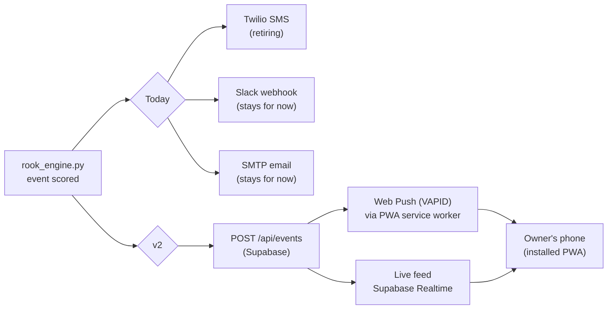

# Rook Dashboard v2 — Concept Notes

> Design-stage reference only. Per **D8**, actual build work waits until a custom
> model ships and emits `model_card.json` — there is no live custom-class data to
> visualize yet. This document exists so the concept isn't lost between now and
> then, and so hardware/schema decisions made earlier (goal 5-6) don't
> accidentally foreclose it.

**This file is the canonical Rook 2.0 dashboard/experience reference.** The
richer prior canvas (below) is a chat-session artifact — not in Dropbox or
git, invisible to a fresh `begin` — so it cannot be the durable source of
truth even though it's currently more developed. Anything from it worth
keeping belongs copied into this file, not left stranded there.

## Prior work (found after this doc was first written)

A more developed concept already exists from a 2026-06-13 session: the
**"Rook App Experience"** canvas (`rook-app-experience.canvas.tsx`) — a "3-in-1
ambient app" pitch (weather/phenomena station, wildlife codex, traffic
visualization) with real charts, a verified iOS Web Push capability table, and
a 4-phase build plan. Treat that canvas as the primary vision reference; this
doc's job is tracking what's *changed* since (the two decisions locked in
above) and what's blocking (D8, data volume).

**Two corrections this doc got wrong relative to that prior research:**

1. **iOS web push is not an open question — it's already verified.** The prior
   session checked Apple/WebKit docs directly: Web Push to a Home-Screen PWA is
   supported since iOS 16.4, no Apple Developer Program required. The real,
   still-true limit is narrower than "iOS support" — **Critical Alerts (the
   entitlement that pierces Focus/Do Not Disturb) are native-app-only and
   unavailable to web push, full stop.** That's the actual emergency-parity gap
   (see Open Questions below), not a latency question.
2. **SMS isn't being retired by preference — it's already effectively
   non-functional.** The prior session found personal-use A2P 10DLC
   registration is categorically carrier-policy-ineligible (not Twilio-specific)
   and confirmed a hard Verizon rejection (`552 5.2.0 rejected AUP#POL`) on a
   real test message. **This fact currently exists nowhere in `DECISIONS.md` or
   `HISTORY.md`** — it should probably become its own decision record, since it
   changes "replace SMS" from an architectural preference to a forced
   migration. Flagging rather than fixing silently, per the docs-governance
   rule on cross-doc gaps.

## One-liner

A mobile-first, owner-only web app that **replaces SMS as the real-time alert
channel** and becomes the primary way Rook is experienced day to day — simple,
visual, and installable in minutes, showing everything the yard camera sees
(deliveries, wildlife, weather, anomalies) as a scannable, emoji-forward feed
instead of a text thread.

## Decisions locked in (this session)

| Question | Decision |
|---|---|
| Who can access it? | **Owner only.** Private, auth-gated, but usable from any phone/location — not a multi-user share, not public. |
| Does it replace SMS? | **Yes, fully.** SMS/Twilio is retired once the dashboard's push notifications reach parity; no dual-running long-term. |

These supersede the more conservative framing in `refinements.md` §4 ("owner-only
web UI for **configuration**... not a raw data feed") — v2 is now the *primary*
experience, not just a settings portal alongside SMS.

## Why this is a real architecture change, not just a new page

The current system's real-time path is push-based and channel-owned by Twilio:
Pi → engine scores an event → SMS/Slack/email fire immediately. A dashboard is
pull-based by nature (you have to open it) unless it *also* pushes. Fully
replacing SMS means the dashboard must close that gap itself:

The emergency-bypass rule in `Rook - Project Overview.md` §4 ("flashing lights /
spatial rule-break → bypass all delays, `🚨` alert") has no channel-agnostic
equivalent yet — web push must be proven reliable (including on iOS Safari,
which only supports it for PWAs added to the home screen, not the browser tab)
before SMS can be safely turned off for that case specifically. See Open
Questions.

## Experience pillars (from the brief)

1. **Super simple** — one primary screen (the feed), not a settings-first app.
   Complexity (thresholds, quiet hours, class toggles) lives one tap deeper.
2. **Highly visual** — every event is a card with an image (annotated frame or
   Beast Cam crop), not a text line. Emoji vocabulary (`docs/emoji_vocabulary.md`)
   carries over as the iconography language, just rendered instead of texted.
3. **Easy to set up / install** — no SSH, no hand-edited `.env`, no App Store
   listing. Add-to-home-screen PWA with a pairing flow (see below).
4. **Diverse content** — not just alerts. Wildlife, weather, and daily rhythm
   belong in the feed even when nothing "alert-worthy" happened.

## Information architecture

| Screen | Content | Data source |
|---|---|---|
| **Home / Feed** | Reverse-chron cards: detections, lingering events, digest recaps, weather snapshots interleaved | `events` table (Supabase), Realtime subscription |
| **Wildlife** | Beast Cam gallery, grouped by species once the custom model is live; "seen today / this week" counts | `beast_cam` crops + custom-class detections (`docs/llm_autolabel_pipeline.md` species set) |
| **Weather strip** | Current conditions + today's forecast as ambient context on Home, not a separate destination | Open-Meteo (already integrated read-only per `PRIVACY.md`) |
| **Activity** | Daily/weekly stats — the existing digest content, visualized (counts by class, busiest hours) instead of emailed as text | `daily_stats` |
| **Device** | Heartbeat, temp, model version (`model_card.json` → `model_versions` table), Wi-Fi | Existing `refinements.md` §4 design, unchanged |
| **Setup** | First-run pairing wizard | New |

## Diverse content — what "wildlife, weather, etc." pulls from

This is mostly assembly of things Rook already produces or already has
read-only access to, not new data collection:

- **Wildlife**: Beast Cam crops today; species-labeled cards once custom
  classes (`coyote`, `deer`, `raptor`, `cardinal`, ...) are live (goal 6).
- **Weather**: Open-Meteo is already a configured third-party read (per
  `PRIVACY.md`'s third-party table) — currently used only as a context hint,
  never surfaced. v2 just displays it.
- **Deliveries / municipal**: vendor vehicle classes (`ups_truck`,
  `trash_truck`, ...) once trained; today falls back to generic `truck`.
- **Anomalies / phenomena**: `smoke`, `downed_tree` (scene-level, once trained);
  emergency responders always bypass to push regardless of dashboard state.
- **Daily rhythm**: the 3 AM digest becomes a feed card instead of an email —
  same data (`daily_emoji_log`, `prev_day_stats`), new rendering.

No new sensor or API integration is required to hit "diverse" — the ingredients
already exist across `rook_engine.py`, Beast Cam, and Open-Meteo; v2's job is
surfacing them visually in one place instead of splitting them across
SMS/Slack/email/digest.

## Setup / install flow ("easy to set up")

Goal: replace `~/rook-env/.env` hand-editing and SSH with something a
non-technical owner can do from their phone in a few minutes.

1. Pi boots, engine has no paired dashboard yet → generates a short-lived
   **pairing code** (e.g. 6 digits) shown nowhere but logged / or displayed via
   a temporary local status LED pattern — needs a decision (see Open Questions:
   how does a headless Pi display a code without a screen?).
2. Owner opens the dashboard URL on their phone, signs in (magic link —
   already planned in `Rook - Project Overview.md` §5), enters the pairing
   code.
3. Dashboard writes device config to Supabase; Pi picks it up on its existing
   60s config-poll loop (`refinements.md` §4 design, unchanged) — no `.env`
   editing.
4. Browser prompts "Add to Home Screen" → PWA installed, push permission
   requested inline with a plain-language reason ("get alerts without SMS").

## Visual design direction

- Monochrome-plus-one-accent, matching the existing rook/tower mark
  (`Media/rook_logo.png`) — black/white base, single accent color for
  alert/urgency states (mockups below use amber).
- Card-based feed, emoji as the primary iconographic language (carries the
  existing vocabulary forward 1:1, no new symbol set to learn).
- Dark-mode-first (it's a yard camera app; most engagement is checking "who's
  outside" at night).

## Mockups (concept-stage, for reference)

Three key screens, generated to pin down the visual language before any code:

1. **Home feed** — `Media/dashboard_v2_mockup_home_feed.png`
2. **Wildlife / species gallery** — `Media/dashboard_v2_mockup_wildlife.png`
3. **Setup / pairing** — `Media/dashboard_v2_mockup_setup.png`

These are illustrative, not pixel specs — the point is confirming direction
(card density, emoji-forward iconography, dark mode) before real design work.

## Open questions (need answers before this leaves concept stage)

1. **Emergency bypass parity — real gap, not a latency question.** Web push
   cannot obtain the Critical Alerts entitlement (confirmed against
   Apple/WebKit docs) — there is no way for a PWA to pierce Focus/Do Not
   Disturb the way a native app could. Since SMS is already non-functional
   (see below), this isn't "what do we give up by switching" — it's an
   existing gap regardless. Mitigation is likely a native-app-only Critical
   Alert path *later* (post-Hailo phase per the prior canvas), or accepting
   email/Slack as the DND-piercing backstop for the `🚨` case in the meantime.
2. **Headless pairing code display** — the Pi has no screen. Options: print to
   a temporary local webpage on the Pi's own IP (needs owner to know the IP),
   a physical QR sticker with a static device ID + one-time claim, or a
   short-range fallback (Bluetooth/AP mode) purely for first pairing.
3. **Missing decision record: SMS is already non-functional, not just being
   retired by choice.** The confirmed carrier-policy ineligibility + Verizon
   `AUP#POL` rejection (prior session, 2026-06-13) should be written up as its
   own `DECISIONS.md` entry — it's the actual reason "full replace" is the only
   viable option, and right now that reasoning only lives in an old chat
   transcript, not in the governing docs.
4. **Twilio sunset sequencing** — `SMS_COMPLIANCE.md`, `PRIVACY.md`, and
   `TERMS.md` all currently describe SMS as a live channel; retiring it is a
   docs change too (mark the A2P campaign deregistered, update the privacy
   table), not just a code change — arguably overdue given #3.
5. **Sequencing vs. D8** — this stays a concept doc until a `model_card.json`
   exists; revisit scope once goal 6 lands, since "diverse" content quality
   (wildlife species cards, vendor vehicle cards) depends entirely on the
   custom model being real.
